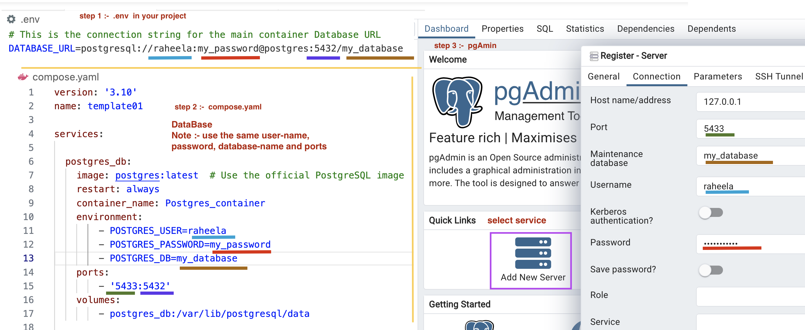
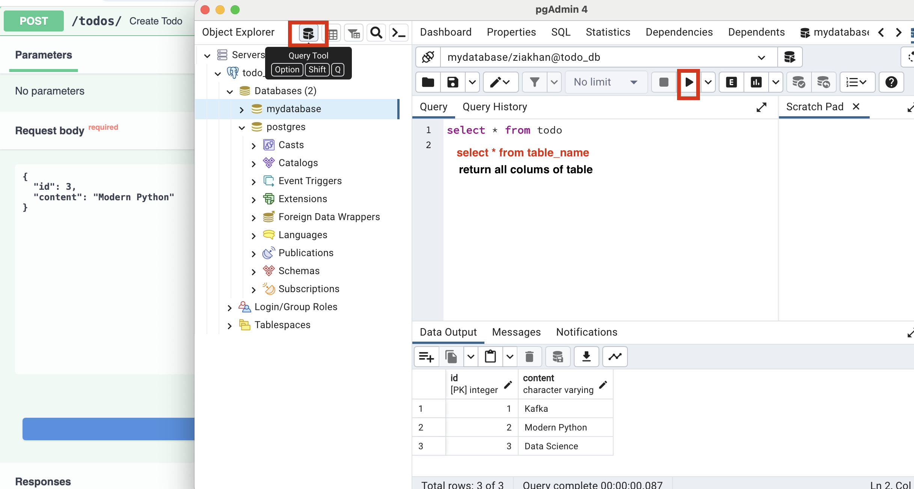

## Oneline Api

Interactive Online Mart, use fast api, docker

**add poetry drivers** (one line command)
```shell
poetry add fastapi sqlmodel uvicorn\[standard\] psycopg 
```

**=================================================================**


 **build new image** 
```shell
 docker compose up -d 
```
build the image and starts the container in detached mode 

Note :- -d, --detach  (Detached mode: Run containers in the background)

 **rebuild the image** 
  ```shell
 docker compose up -d --build 
```
(recreate the image —> - - build)

**container detail** 
 ```shell
 docker compose config 
```

**stop running container**
```shell
 docker compose stop

 docker stop {OPTIONS} containerID/container_name
```

**restart container**
  ```shell
 docker restart container_name/container_id
```

**stops and removes the container**
```shell
 docker compose down
```
1. Stop all containers
2. Remove all containers
3. Remove all networks

**view logs** 
 ```shell
 docker-compose logs service-name
```

**view logs (real-time monitoring)**
 ```shell
 docker-compose logs service-name -f
```
- f  (follow)(real-time.) (give all the command running on terminal)
  
**display container** 
 ```shell
 docker compose ps 

 docker ps {OPTIONS}
```
-a flag:  shows us all the containers, stopped or running. {-a: Stands for "all"}

-l flag: shows us the latest container.

-q flag: shows only the Id of the containers. 

display : NAME ,  IMAGE,   COMMAND,  SERVICE,  CREATED , STATUS ,  PORTS
    
 **container list**
```bash
 docker compose ls 

 docker container ls {OPTIONS}

 docker container  ls -a
```
display containers :-  NAME  - STATUS  -  CONFIG FILES
-a : all  (list of all containers, both running and stopped)

**forcefully stop running container** 
 ```shell
 docker kill containerID/container_name 

 docker kill {OPTIONS} containerID/container_name 
```

generate a random string of bytes in hexadecimal format
```bash
openssl rand -hex 12
```

### pgAdmin

<div style="text-align: center;">
    </img>
</div>

### Query Tool

<div style="text-align: center;">
    </img>
</div>


#### video

**(Pg Admin)**
GenAI Quarter 5 Online Class 08: Docker Compose - Running Multi Containers with Docker Compose
https://www.youtube.com/watch?v=l5eZMAhDwhQ&t=3117s


**(FastAPI Authentication)**
GenAI Quarter 5 Online Class 11: Kafka Container - Docker Compose for Kafka & FastAPI Authentication
https://www.youtube.com/watch?v=8nM1suLA0f4


**(Dev Container)**
Dev Container Online Class 06: What is Dev Container (Development inside Containers) - Docker
https://www.youtube.com/watch?v=h32qw986-tI

**(Docker Compose)**
GenAI Quarter 5 Online Class 07: Docker Compose - Orchestrate Multi-Container Applications with Ease
https://www.youtube.com/watch?v=cpu44VE_J1I&t=5554s 


**(Kafka Messages)**
GenAI Quarter 5 Online Class 13: Serialization and Deserialization Kafka Messages
https://www.youtube.com/watch?v=qVbAYHxW3xg


**(Portobuf)**
GenAI Quarter 5 Online Class 14: Protobuf in Kafka & Introduction to Kong - An API Gateway
https://www.youtube.com/watch?v=nMXMV48EiQA


#### Github

[Docker Compose with Database Service](https://github.com/panaverse/learn-generative-ai/tree/main/05_microservices_all_in_one_platform/14_docker/05_compose_db)

[kafka_messaging](https://github.com/panaverse/learn-generative-ai/tree/main/05_microservices_all_in_one_platform/15_event_driven/02_kafka_messaging)

[Protobuf Kafka Messaging](https://github.com/panaverse/learn-generative-ai/tree/main/05_microservices_all_in_one_platform/15_event_driven/03_protobuf)

[FastAPI Authentication](https://github.com/panaverse/learn-generative-ai/tree/main/05_microservices_all_in_one_platform/16_oauth2_auth)

[Tokens](https://github.com/panaverse/learn-generative-ai/tree/main/05_microservices_all_in_one_platform/16_oauth2_auth/00_generate_access_token)


### tutorials


[SQL Model : Update Data - UPDATE](https://sqlmodel.tiangolo.com/tutorial/update/?h=update)

[Form Data](https://fastapi.tiangolo.com/tutorial/request-forms/)

[FormData vs. JSON: Comparison](https://chatgpt.com/share/dc922c6e-10cd-4423-9c7a-621755d42787)

[Fastapi-mail](https://sabuhish.github.io/fastapi-mail/)

[Compose works](https://docs.docker.com/compose/compose-application-model/)

[docker compose profile](https://docs.docker.com/compose/compose-file/15-profiles/)

**OAuth2 with Password (and hashing), Bearer with JWT tokens**
[Hash and verify the passwords](https://fastapi.tiangolo.com/tutorial/security/oauth2-jwt/?h=jwt#hash-and-verify-the-passwords)


**=================================================================**


 #### set a newly generated UUID's hexadecimal representation

**default=lambda: uuid.uuid4().hex**

```python
import uuid
    kid: str = Field(default=lambda:uuid.uui4().hex)
```
user_models.py
```python 
class User(UserModel, table=True):
    user_id: Optional[int] = Field(int, primary_key=True)
    kid: str = Field(default=lambda:uuid.uui4().hex)
```

**Field(...):** Field is a class from Pydantic used to define metadata for fields in a Pydantic model.

**default=lambda: uuid.uuid4().hex**

**default=** specifies the default value for the kid field.
**lambda:** introduces an anonymous function that generates a default value.
**uuid.uuid4()** generates a random UUID (Universally Unique Identifier) version 4.
**.hex** converts the UUID object to its hexadecimal string representation.


[Default values](https://python.useinstructor.com/concepts/fields/)

id: Annotated[str, Field(default_factory=lambda: uuid4().hex)]

**=================================================================**

#### Pydantic model_dump() 

```python
def add_user_in_db(user_form: UserModel, session: Session):
    user = User(**user_form.model_dump())   
```

#### Full Flow :-User(**user.model_dump())
**1- Pydantic Model:** UserModel instance (user_form) holds user details.
**2- Convert to Dictionary:** user_form.model_dump() converts the instance to a 3 dictionary.
**3- Dictionary Unpacking:** **user_form.model_dump() unpacks the dictionary into keyword arguments.
**4- Create User Object:** User(**user_form.model_dump(), user_password=hashed_password) creates a new User object with the provided details and the hashed password.

**model_dump()** method in Pydantic :- converts a model instance into a dictionary with the model's attribute names as keys and their corresponding values.

returns a standard Python dictionary (dict) containing the attributes and values of the model instance.

```python
user = UserCreate(name="John")
User(**user.model_dump())   
```

[Pydantic model_dump() return exact type](https://stackoverflow.com/questions/77476105/can-pydantic-model-dump-return-exact-type)

**=================================================================**

#### datetime

**add_date : datetime = Field(default=datetime.now(timezone.utc))**

[timedelta Objects - Python](https://docs.python.org/3/library/datetime.html#datetime.timedelta)

[Get Current Time in different Timezone using Python - Greeks](https://www.geeksforgeeks.org/get-current-time-in-different-timezone-using-python/)

**=================================================================**

**one_or_none() either use has data or none**

```python
    statement = select(User).where(User.user_email == user_details.user_email)
    db_user_info = session.exec(db_statement).one_or_none()
```

**one():- if user don't has password it can't go further so use one_or_none()**

[How to use SQLAlchemy's `one_or_none` query method?](https://stackoverflow.com/questions/50310979/how-to-use-sqlalchemys-one-or-none-query-method)

**=================================================================**


### Volume (compose.yaml)

**1- Bind Mount Volume (BMV):**
A bind mount volume is a directory on the host machine that is mounted into a container.

##### -./host-machine:/container

```yaml 
volumes:
      - ./service_name:/code  # Sync local development directory with the container
```

**2- Persistent Volume (PV):** 
A persistent volume is a resource that is provisioned and managed by Kubernetes. It is used to store data that needs to be preserved even if a Kafka container is deleted or recreated.
In both cases, the data is stored outside of the container, so it is not lost when the container is deleted or recreated

Bind Mount Volume (BMV): a directory on the host machine that is mounted into a container.

Persistent Volume (PV): a resource that is provisioned and managed by Kubernetes.

**=================================================================**

# online_mart
